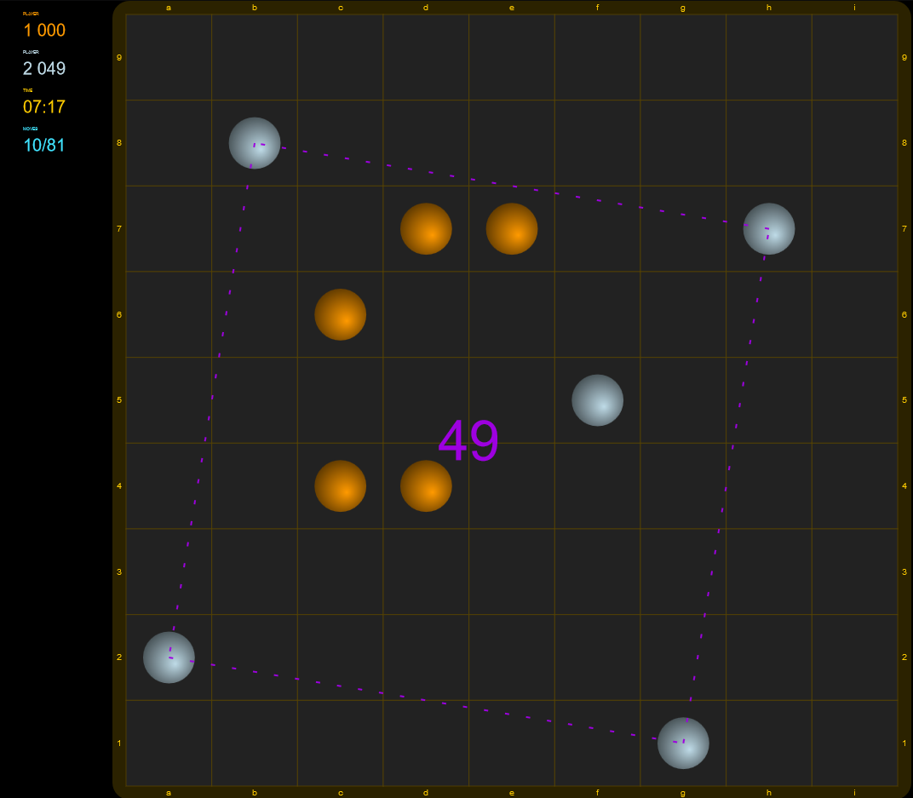

# re-squares
A Meta Squares clone written in ReasonML

## Rules
Two players take turns placing pieces on the board. These pieces can't move once placed. The object of the game is to make squares with these pieces. The larger the square, the more points it's worth. Squares may be tipped at any angle(Ex: a diamond is a valid square). You win when you get over 150 points with at least a 15 point lead over your opponent.

[online play against an AI](https://bitmagie.de/re-squares/)

